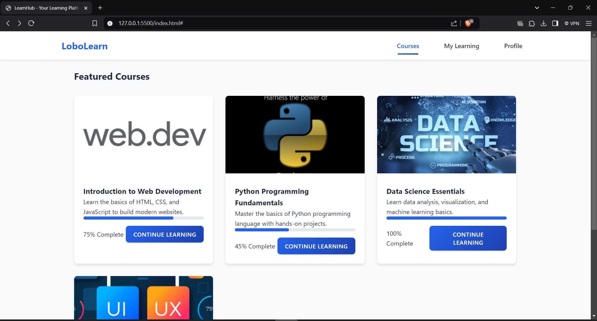
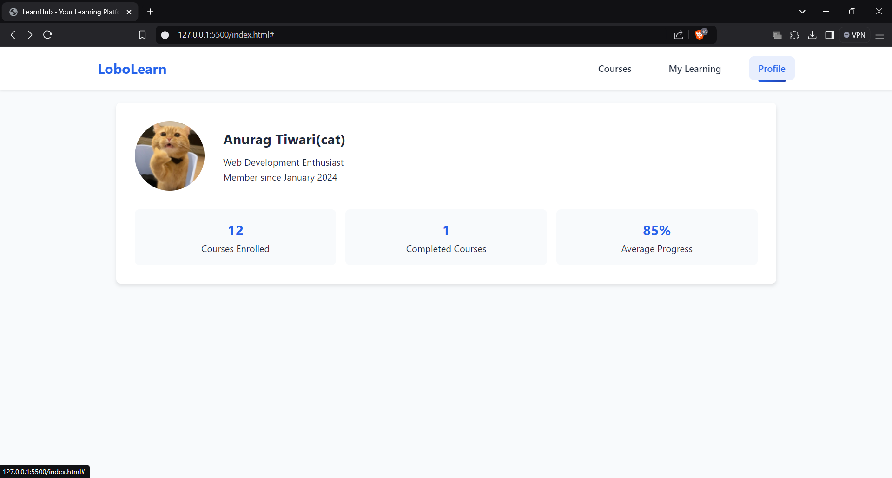
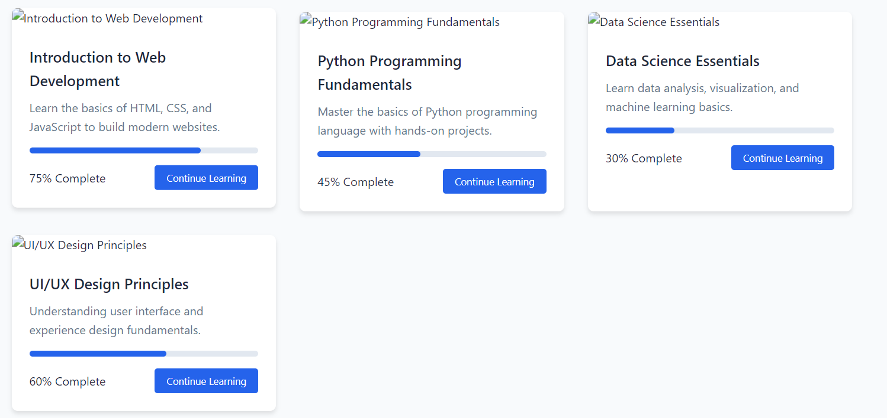
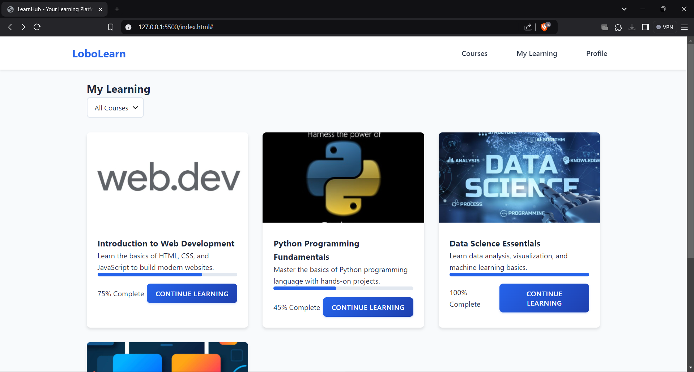
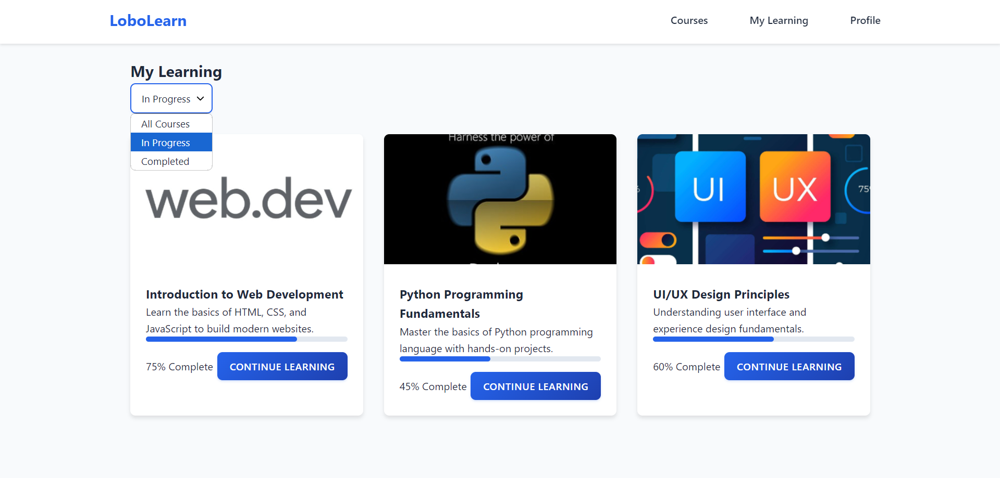
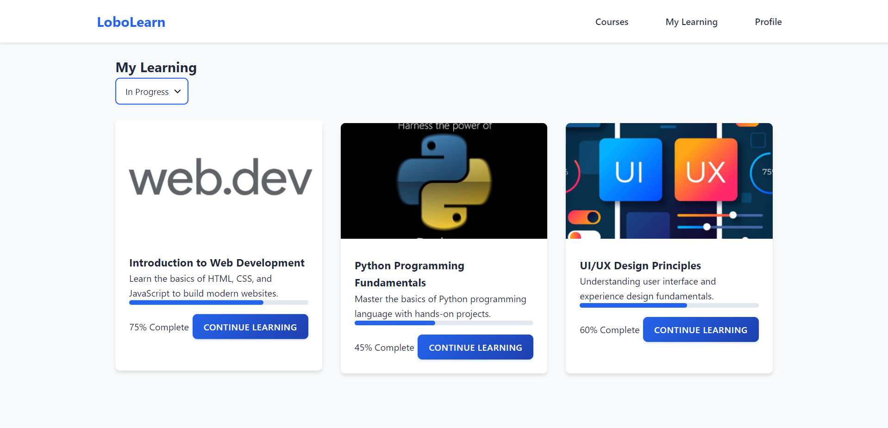

# E-Learning Platform UI Project

**Name**: Anurag Tiwari

**Company**: CODTECH IT SOLUTIONS PVT.LTD

**ID**: CT08DQL

**Domain**: Frontend Web Development

**Duration**: Dec 12th 2024 to Jan 12th 2025

**Mentor**: [Mentor Name]

## Overview of the Project

**Project**: E-Learning Platform User Interface  

## Objective

The goal of this project is to develop a user-friendly and responsive e-learning platform UI that offers a seamless experience for students and instructors. The platform will include features such as course browsing, user registration, and course management. The user interface is designed to be intuitive, ensuring easy navigation and access to essential features.

## Key Features

- **Course Catalog**: Users can browse available courses by categories or search for specific topics.
- **User Registration/Login**: A simple and secure registration and login system for both students and instructors.
- **Responsive Design**: A mobile-friendly and adaptable interface for various screen sizes.
- **Course Details**: Comprehensive course pages with information on the course syllabus, instructor, and enrollment options.
- **User Dashboard**: Personalized dashboard for students and instructors to track progress, manage courses, and view notifications.
- **Interactive Elements**: Hover effects, dropdown menus, and modals for an engaging user experience.
- **Modern UI Elements**: Use of cards, icons, and buttons to enhance the interface's look and feel.

## Technologies Used

- **HTML5**: Structured layout and semantic HTML for clear document structure.
- **CSS3**: Modern styling and responsive design.
  - Flexbox for layout and alignment.
  - Google Fonts integration for aesthetic typography.
  - CSS Grid for complex layouts.
  - Transitions and animations for smooth user interactions.
- **JavaScript**: Adding interactivity to the UI.
  - Form validation for user registration.
  - Dynamic course filtering and sorting.
  - Interactive dropdowns and modals.
- **Libraries/Frameworks**:
  - Bootstrap for responsive design.
  - Font Awesome for icons.
  - jQuery for DOM manipulation (optional).
 
    

## Implementation Details

1. **User Interface**:
   - Clean and modern layout with easy-to-use navigation.
   - Sections for Featured Courses, Popular Instructors, and Upcoming Courses.
   - User-friendly forms for registration and login.
   - Interactive course cards with hover effects for more details.
     
     
     

2. **Course Management**:
   - Categories for course filtering.
   - Dedicated pages for each course with details like syllabus, instructor, and enrollment options.
   - Search functionality to quickly find courses.

3. **Responsive Design**:
   - Media queries to ensure compatibility across all devices.
   - Flexbox and CSS Grid for flexible layouts.

4. **Interactive Elements**:
   - Dynamic course filtering by category or keyword.
   - Modal popups for course details and user messages.
   - Smooth transition animations for UI elements.

## Future Enhancements

- **Instructor Dashboard**: More features for instructors to manage courses, upload materials, and track student progress.
- **Student Progress Tracking**: Integration of progress bars, quiz results, and certificates.
- **Discussion Forums**: Chat or discussion board for students and instructors to interact.
- **Video Integration**: Embedding video lectures and multimedia content.
- **Dark Mode**: Option for users to switch between light and dark themes.
- **Course Reviews and Ratings**: Students can rate and review courses to help others make informed decisions.
- **Admin Panel**: Admin panel to manage users, courses, and reports.

